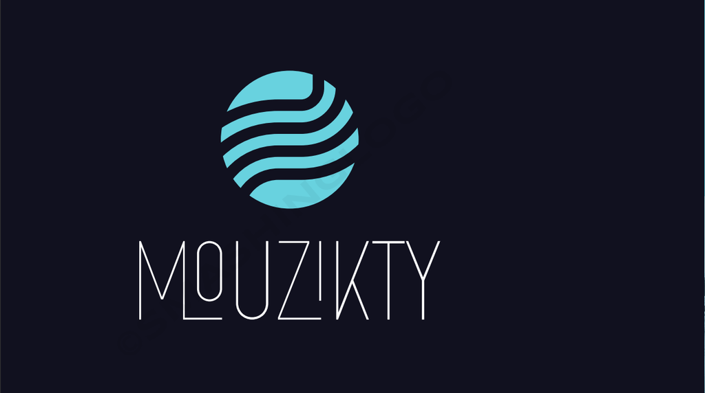

# Mouzikty Music Player



Mouzikty is a modern and user-friendly music player application built with PyQt5 and MySQL for seamless user authentication. It provides an intuitive interface for music playback, playlist management, and user account registration. Enjoy your favorite tunes hassle-free with features like shuffling, repeating, and a history of your recently played songs.

## Table of Contents

- [Features](#features)
- [Prerequisites](#prerequisites)
- [Installation and Usage](#installation-and-usage)
- [Screenshots](#screenshots)
- [License](#license)
- [Acknowledgments](#acknowledgments)

## Features

- **User Authentication:** Securely log in to your personalized music experience. Your playlists are just a login away.

- **Local Music Playback:** Play your favorite songs from your local music library with ease.

- **Dynamic Playlists:** Create, manage, and save playlists effortlessly.

- **Enhanced Playback Controls:** Control your music with play, pause, next, and previous track functions.

- **Shuffle and Repeat:** Customize your listening experience with the ability to shuffle your playlist or repeat your favorite tracks.

- **Volume Control:** Adjust the volume to your liking with the user-friendly slider.

- **Password Strength Indicator:** Ensure a strong password during registration with our built-in password strength meter.

- **Recent Play History:** Quickly access your recently played songs for an improved listening experience.

## Prerequisites

Before running Mouzikty, ensure you have the following installed:

- **Python 3.x**
- **PyQt5**
- **PyQt5 Multimedia**
- **PyQt5 QtMultimediaWidgets**
- **PyQt5 QtMultimedia**
- **PyQt5 QtSql**
- **MySQL Connector**
- **MySQL Server:** Install and configure a MySQL server with appropriate user and database setup.

## Installation and Usage

1. **Clone the Mouzikty repository to your local machine:**

   ```bash
   git clone <repository_url>
